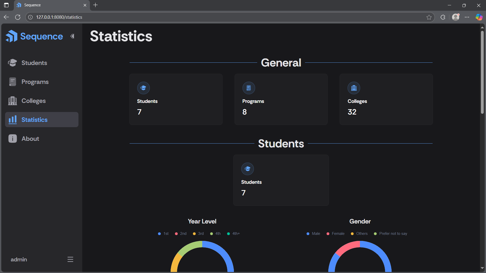
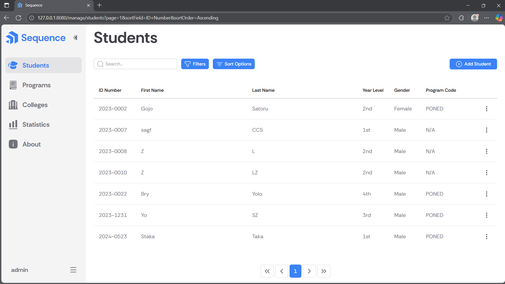

# Sequence, a full-stack simple student information system (SSIS)

Sequence is a full-stack simple student information system (SSIS) built using Nuxt (Vue 3), Flask (Python), PostgreSQL, and Supabase Storage. It is made in accordance with the requirements of CCC181. 

The name 'Sequence' comes from the fact that the data in this application is stored in a particular order, hence, a sequence.

## Tech Stack

### Frontend
Built with Nuxt 3 (Vue 3) for a fast, reactive single-page application. Styled using Nuxt UI and Tailwind CSS for a consistent, responsive design.

### Backend
Powered by Flask (Python 3.10+) to provide a RESTful API layer. Pipenv is used to manage dependencies and environments.

### Database & Storage
- PostgreSQL: Stores structured application data, fully containerized using Docker. pgAdmin included for graphical database management.
- Supabase Storage: Used to store user-uploaded images for student avatars, providing secure and scalable object storage.

### DevOps
The application uses Docker to orchestrate containers and ensure reproducible development setups.

## Requirements

### Frontend
- Node.js (v18+)
- npm
- Nuxt 3
- Vue 3
- Nuxt UI
- TailwindCSS

### Backend
- Python 3.10+
- Flask
- Pipenv

### Database & Storage
- Docker (for containerized PostgreSQL and pgAdmin)
- PostgreSQL
- pgAdmin
- Supabase Bucket (to store user-uploaded images for student avatars)

## Features

- Create, read, update, delete, and list (CRUDL) operations for students, programs, and colleges
- Search and sort operations
- Containerized data storage using PostgreSQL  
  → meaning the database runs inside a Docker container, isolated from your local environment. This ensures consistency, portability, and easier maintenance.
- Utilizes pagination for data display and efficiency
- REST API built with Flask
- Visually appealing design using Nuxt UI
- Statistics page to visualize system data
- JWT-based user authentication (access + refresh tokens stored in cookies)
- Single Page Application (SPA) for seamless user experience
- Theme customization, with support for many colors, and light/dark mode
- Students can have avatars; supports image upload, update, deletion, and storage using Supabase Storage

## Screenshots

| Page | Preview |
|------|----------|
| Login Page |  |
| Manage Students Page |  |
| Manage Programs Page |  |
| Statistics Page |  |
| About Page |  |
| Light Mode |  |
| Theme Changer |  |

## Cloning the project locally

To get started, clone the repository to your local machine using Git.
Run the following command in your preferred terminal (Command Prompt, Bash, or PowerShell):

``` bash
git clone https://github.com/xbryan25/ccc181-ssis.git
cd ccc181-ssis
```
This will download the project files and move you into the project directory, where you can begin setting up the database and running the app locally.

## Database setup
Before running in **Development** or **Production** mode, you must first set up the PostgreSQL database using Docker. 

The PostgreSQL database and pgAdmin dashboard are fully containerized using Docker. This means Docker handles downloading and running both tools automatically — you don’t need to install PostgreSQL or pgAdmin manually.

### 1. Navigate to the database folder

From the project root, go to the db directory:

```bash
cd db
```

### 2. Create a .env file

Create a .env file inside the db folder based on .env.example:

```bash
cp .env.example .env
```

Then open .env and fill in your desired credentials:

```bash
# PostgreSQL configuration
POSTGRES_USER=your_postgres_user
POSTGRES_PASSWORD=your_postgres_password
POSTGRES_DB=your_postgres_db
POSTGRES_PORT=5432

# pgAdmin configuration
PGADMIN_DEFAULT_EMAIL=your_pgadmin_default_email
PGADMIN_DEFAULT_PASSWORD=your_pgadmin_default_password
PGADMIN_PORT=5080
```

The values above are just placeholders — you can change them if needed.
Make sure the ports you choose (5432 for PostgreSQL, 5080 for pgAdmin) are available on your system.

### 3. Initialize and start the containers

```bash
docker compose up -d
```

This command tells Docker to use the instructions in docker-compose.yml to:

- Pull and start the PostgreSQL (db) and pgAdmin (pgadmin) containers
- Use your .env values for usernames, passwords, and ports
- Automatically initialize the database using init.sql
- Persist your data in a local folder named postgres-data (not tracked by .git)

### 4. Access the tools

PostgreSQL will be available at
- localhost:<POSTGRES_PORT> (default: 5432)

pgAdmin will be accessible at
- localhost:<PGADMIN_PORT> (default: 5080)

Login to pgAdmin using the email and password you set in .env.

## Running the project locally

After setting up the database, you can run the project in two modes:
**Development Mode** (Nuxt + Flask on separate servers) or **Production Mode** (Flask serves both).

### 🧪 Development Mode

In this mode, Nuxt and Flask run on separate servers.

#### 1. Prerequisites
Make sure you have:
- **Docker** and **Docker Desktop** installed on your system
- Docker containers initialized using the provided `docker-compose.yml` and `init.sql`
- `.env` and `.flaskenv` properly configured using the provided examples

#### 2. Run the database
```bash
docker compose up -d
```

#### 3. Start the backend (Flask API)
```bash
cd app
pipenv install # This may take a while, skip this step if already installed for the first time
pipenv shell
flask run
```
Flask will usually run on **http://127.0.0.1:8080** if the .flaskenv configuration is set exactly like .flaskenv.example

#### 4. Start the frontend (Nuxt App)
```bash
cd app/nuxt
npm install # This may take a while, skip this step if already installed for the first time
npm run dev
```
Nuxt will run on **http://127.0.0.1:3000**

#### 5. Build updated frontend files (optional)
If you modify the frontend and want Flask to serve it, run:
```bash
build.bat
```
This moves the generated Nuxt files into `app/static` and `app/templates`.

### ⚙️ Production Mode

In this mode, Flask serves both the API and Nuxt’s built static files.

#### 1. Ensure docker containers are running
```bash
docker compose up -d
```
#### 2. If you haven't done already, build the frontend files
To serve Nuxt on Flask run:
```bash
build.bat
```
This moves the generated Nuxt files into `app/static` and `app/templates`.

#### 3. Start Flask
```bash
pipenv shell
flask run
```
Flask will serve both the API (`/api/...`) and frontend (`/`).

### 🧩 Pros and Cons

| Mode | Pros | Cons |
|------|------|------|
| **Development** | Hot reload for both frontend and backend | Requires two separate servers; possible CORS setup |
| **Production** | Unified app, easier deployment | Must rebuild Nuxt files after frontend changes |

## Additional notes

- Update `init.sql` whenever database schema changes.
- Ensure `.env` and `.flaskenv` are configured before running.

## Feedback

If you have any feedback, please reach out to @xbryan25 using this [email](mailto:bryanaganp25@gmail.com).

## License
This project is licensed under the MIT License.


